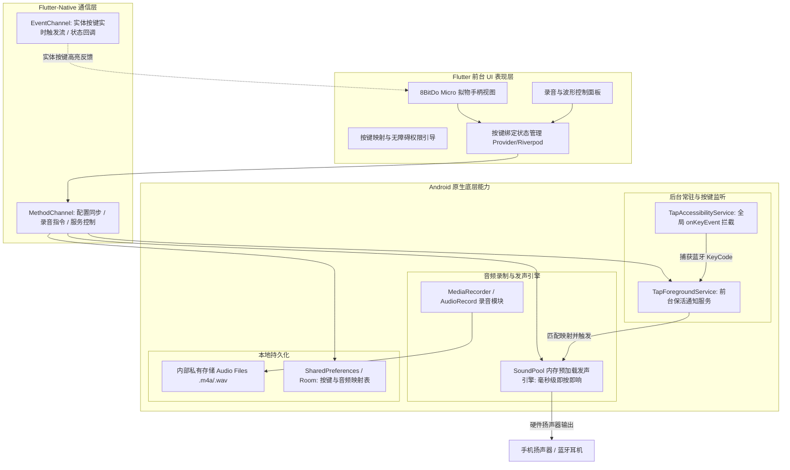

# TapVoice 技术方案设计文档 (Android + Flutter)

## 一、 项目概述

**TapVoice (手柄音盒)** 是一款将便携式蓝牙手柄（以 **8BitDo Micro** 为代表）转换为随身自定义音频触发器的 Android 客户端应用。
用户可以在前台通过拟物化的手柄交互界面，为手柄的 12+ 个物理按键录制专属音频；当应用切换到后台甚至手机息屏锁屏时，只要按下实体手柄按键，手机即可在毫秒级无感触发并播放对应按键的音频。

---

## 二、 总体技术架构与分层

考虑到核心诉求是：
1. **精美流畅的前台交互 UI**（手柄拟物化视图、录音动效、按键状态管理、波形/进度反馈）；
2. **强大的全天候后台/锁屏全局按键捕获与低延迟发声**；

架构采用 **Flutter (前台 UI & 业务逻辑) + Android 原生 Plugin/Service (后台常驻、无障碍全局按键拦截、SoundPool 低延迟播放)** 的混合架构。



---

## 三、 核心模块详细设计

### 1. 硬件连接与按键工作模式 (8BitDo Micro)
8BitDo Micro 手柄底部具备三种拨档（D / S / K）：
- **K 档（Keyboard 键盘模式，强烈推荐）**：
  手柄作为标准蓝牙外接键盘工作。每个物理按键发送一个标准的 Android `KeyEvent`。
  - **方向键 (D-pad)**：`KEYCODE_DPAD_UP`, `KEYCODE_DPAD_DOWN`, `KEYCODE_DPAD_LEFT`, `KEYCODE_DPAD_RIGHT`
  - **XYAB 键**：对应标准按键或映射字符（如 `KEYCODE_A`, `KEYCODE_B`, `KEYCODE_X`, `KEYCODE_Y` 等，可通过八位堂官方软件自定义）
  - **功能键**：`+`, `-`, `Star`, `Heart/Home`
  - **肩键**：`L`, `R`, `L2`, `R2`
- **D 档（D-Input 手柄模式）**：
  发送标准 Gamepad 信号。通过 Android 系统的 `InputDevice` / `onGenericMotionEvent` 监听。

> **方案首选**：使用 **K 档（键盘模式）**。在 Android 的 `AccessibilityService` 机制下，键盘模式的 `KeyEvent` 是 100% 能被全局拦截的最稳定机制。

---

### 2. 后台与锁屏全局按键拦截（Android 原生无障碍服务）

#### 原理：`AccessibilityService.onKeyEvent`
普通 Activity 失去焦点或手机锁屏后，系统不再向其分发按键事件。通过注册 `AccessibilityService` 并声明 `canRequestFilterKeyEvents="true"`，App 可以在整个操作系统底层最先收到硬件按键广播。

#### 关键实现逻辑：
```kotlin
class TapAccessibilityService : AccessibilityService() {
    override fun onKeyEvent(event: KeyEvent): Boolean {
        // 只处理按下动作，避免弹起时重复触发
        if (event.action == KeyEvent.ACTION_DOWN) {
            val keyCode = event.keyCode
            // 检查是否有该 KeyCode 对应的音频映射
            val handled = TapAudioEngine.playByKeyCode(keyCode)
            if (handled) {
                // 通知 Flutter 前台高亮（如果前台存活）
                TapChannelManager.notifyKeyPressed(keyCode)
                return true // 消费该事件，防止系统产生默认按键响应
            }
        }
        return super.onKeyEvent(event)
    }
}
```

---

### 3. 低延迟音频引擎设计（SoundPool）

#### 为什么不用 MediaPlayer？
- `MediaPlayer` 适合播放长歌曲，每次播放需经历 `prepare` -> `start`，存在 60~150ms 延迟，手柄按压会有明显的“滞后感”。
- **`SoundPool`** 专门为游戏音效设计，音频文件在加载时会被完全解码为无损 PCM 缓存于内存中：
  - **触发延迟 < 5ms**（即按即出）；
  - **支持多音频并发叠加**（例如同时按多个键，声音不会被互相打断）；
  - 支持音量调节、循环次数与播放速率控制。

#### 音频生命周期管理：
1. **录音保存**：录音完成后生成 `.m4a` 或 `.wav` 文件存储于 `/data/user/0/com.tapvoice.app/files/audios/`；
2. **预热加载**：App 启动或录音完成后，调用 `soundPool.load(audioPath, 1)` 返回 `soundId`，并存入 KeyCode 映射内存缓存；
3. **快速触发**：收到按键事件直接执行 `soundPool.play(soundId, 1.0f, 1.0f, 1, 0, 1.0f)`。

---

### 4. 前台拟物手柄交互 UI 设计（Flutter）

界面完全对标设计原图，横屏/竖屏自适应：

```
+-------------------------------------------------------------------+
| 1.3 sec  ========[========]======== (波形/进度)    Recording  (●)DZ |
+-------------------------------------------------------------------+
|                                                                   |
|   +------------- 8BitDo Micro 拟物手柄 ------------+     ● ● ●     |
|   |   [L1]                              [R1]      |   (状态指示)   |
|   |         (-)  (·)  (+)        (X)              |               |
|   |     ^              (8BitDo) (Y) (A)           |     [ 🎤 ]    |
|   |   < · > ◄ 选中红点  micro    (B)              |    (录音按钮)  |
|   |     v                                         |               |
|   |          (★)  (♥)                             |     [ 🗑 ]    |
|   +-----------------------------------------------+    (清空/删除) |
|                                                                   |
+-------------------------------------------------------------------+
```

#### UI 核心特性：
1. **拟物手柄组件（`GamepadWidget`）**：
   - 包含方向键 (4)、XYAB (4)、+- (2)、Star/Home (2)、LR (2) 等 14 个热区按键；
   - **选中状态**：点击按键显示粉色高亮圆点；
   - **绑定状态**：已录音按键显示绿点标识；
   - **按下动效**：实体按键按下时，界面对应按键产生下压放大或光效涟漪。
2. **录音控制面板（`RecorderPanel`）**：
   - 麦克风长按/点击录制，实时分贝音浪波形显示；
   - 录制完毕回到当前按键的选中状态，试听由用户手动触发；
   - 支持一键删除/重新录制当前按键。
3. **权限与后台常驻引导**：
   - 首页显著卡片提示“无障碍权限开启状态”及“电池优化白名单”。

---

## 四、 项目文件结构划分

```
TapVoice/
├── docs/                                # 方案与设计文档
│   ├── architecture_design.md           # 系统总体架构设计
│   └── key_mapping_spec.md              # 8BitDo Micro 按键映射与配置规范
├── android/                             # Android 原生宿主与后台服务
│   └── app/src/main/
│       ├── AndroidManifest.xml          # 权限、无障碍服务、前台服务声明
│       ├── res/xml/accessibility_service_config.xml # 无障碍按键过滤配置
│       └── kotlin/com/tapvoice/app/
│           ├── MainActivity.kt          # Flutter 宿主 Activity
│           ├── service/
│           │   ├── TapAccessibilityService.kt # 全局按键无障碍监听服务
│           │   └── TapForegroundService.kt    # 前台保活通知服务
│           ├── audio/
│           │   └── TapAudioEngine.kt          # 音频引擎
│           └── channel/
│               └── TapBridgePlugin.kt         # Flutter Platform Channel 桥接
├── lib/                                 # Flutter 跨平台表现层
│   ├── main.dart                        # 入口文件 & 主题配置
│   ├── models/                          # 数据模型（GamepadButton, AudioMapping）
│   ├── providers/                       # 状态管理（ControllerState, AudioState）
│   ├── services/                        # Native 桥接服务、录音管理服务
│   └── ui/
│       ├── home_page.dart               # 主界面布局
│       ├── widgets/
│       │   ├── gamepad_view.dart        # 8BitDo Micro 拟物手柄可视化组件
│       │   ├── button_hotspot.dart      # 单个热区按键交互组件
│       │   ├── recorder_bar.dart        # 顶部录音进度与波形条
│       │   └── action_sidebar.dart      # 右侧录音/删除/试听操作栏
│       └── dialogs/
│           └── permission_guide_dialog.dart # 无障碍与保活权限引导弹窗
└── pubspec.yaml                         # 依赖声明
```

---

## 五、 开发实施里程碑与步骤

1. **第一阶段：Flutter 拟物手柄 UI 与录音原型**
   - 搭建 8BitDo Micro 拟物手柄组件与 12+ 按键热区映射；
   - 集成录音与音频持久化逻辑，建立按键与本地音频文件绑定关系。
2. **第二阶段：Android 原生后台无障碍与 SoundPool 引擎开发**
   - 编写 `TapAccessibilityService` 实现锁屏/后台全局 `KeyEvent` 拦截；
   - 封装 `TapAudioEngine` 预加载音频并实现极速按键触发；
   - 建立 Platform Channel 实现 Flutter 与 Native 的状态双向同步。
3. **第三阶段：后台保活与全流程实机联调**
   - 接入 Foreground Service 常驻通知栏及白名单引导；
   - 连接 8BitDo Micro 实体手柄进行前台联动、后台触发、锁屏触发测试。
