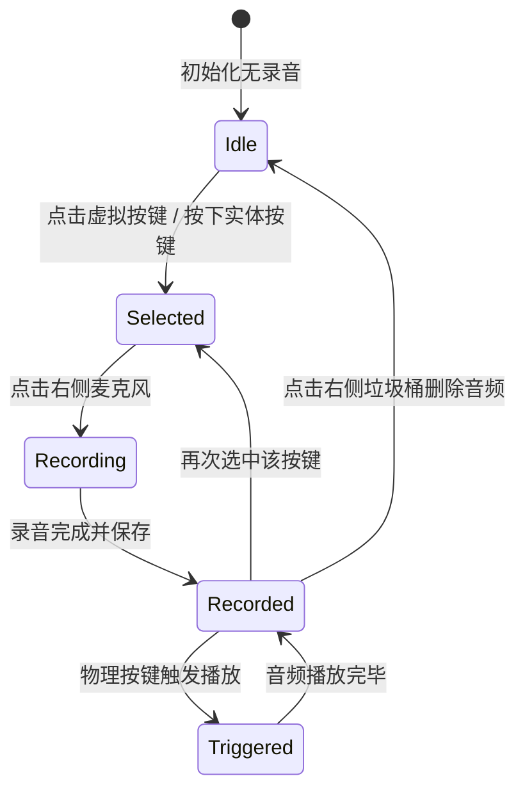

# 8BitDo Micro 按键映射与交互规范 (Key Mapping Spec)

## 一、 8BitDo Micro 物理按键矩阵与 Android KeyCode 映射

8BitDo Micro 在 **K 模式（键盘模式，Keyboard Mode）** 下，各按键对应的默认及推荐 Android `KeyEvent` 如下表所示：

| 按键标识 | 按键名称 | 物理位置 | 默认/推荐 Android KeyCode | KeyCode 常量值 | 对应录音槽位 ID |
| :--- | :--- | :--- | :--- | :--- | :--- |
| **DPAD_UP** | 十字键-上 | 左侧十字键上方 | `KEYCODE_DPAD_UP` / `KEYCODE_W` | 19 / 51 | `btn_dpad_up` |
| **DPAD_DOWN** | 十字键-下 | 左侧十字键下方 | `KEYCODE_DPAD_DOWN` / `KEYCODE_S` | 20 / 47 | `btn_dpad_down` |
| **DPAD_LEFT** | 十字键-左 | 左侧十字键左方 | `KEYCODE_DPAD_LEFT` / `KEYCODE_A` | 21 / 29 | `btn_dpad_left` |
| **DPAD_RIGHT**| 十字键-右 | 左侧十字键右方 | `KEYCODE_DPAD_RIGHT` / `KEYCODE_D` | 22 / 32 | `btn_dpad_right` |
| **BTN_X** | X 键 | 右侧按键区-顶部 | `KEYCODE_BUTTON_X` / `KEYCODE_I` | 99 / 37 | `btn_x` |
| **BTN_Y** | Y 键 | 右侧按键区-左侧 | `KEYCODE_BUTTON_Y` / `KEYCODE_J` | 100 / 38 | `btn_y` |
| **BTN_A** | A 键 | 右侧按键区-右侧 | `KEYCODE_BUTTON_A` / `KEYCODE_K` | 96 / 39 | `btn_a` |
| **BTN_B** | B 键 | 右侧按键区-底部 | `KEYCODE_BUTTON_B` / `KEYCODE_M` | 97 / 41 | `btn_b` |
| **MINUS** | 减号键 (-) | 中间左侧上方 | `KEYCODE_MINUS` / `KEYCODE_E` | 69 / 33 | `btn_minus` |
| **PLUS** | 加号键 (+) | 中间右侧上方 | `KEYCODE_PLUS` / `KEYCODE_O` | 81 / 43 | `btn_plus` |
| **STAR** | 星号键 (★) | 中间左侧下方 | `KEYCODE_STAR` / `KEYCODE_U` | 17 / 49 | `btn_star` |
| **HOME** | 心形/主页键 | 中间右侧下方 | `KEYCODE_HOME` / `KEYCODE_H` | 3 / 36 | `btn_home` |
| **BTN_L1** | 左肩键 L1 | 顶部左侧 | `KEYCODE_BUTTON_L1` / `KEYCODE_Q` | 102 / 45 | `btn_l1` |
| **BTN_R1** | 右肩键 R1 | 顶部右侧 | `KEYCODE_BUTTON_R1` / `KEYCODE_P` | 103 / 44 | `btn_r1` |

> **注**：如果使用八位堂官方的 *8BitDo Ultimate Software (八位堂精英软件)* 自定义了按键映射，TapVoice App 将提供**按键对码学习功能**（在 App 中点击某个按键后，按下手柄任意键即可自动捕获并绑定其专属 KeyCode）。

---

## 二、 前台 UI 热区布局与状态机

### 1. 手柄按键状态机定义
每个按键在 UI 呈现上具有 4 种可视化状态：
1. **Idle（未绑定）**：无小圆点，灰白/原色按键。
2. **Recorded（已绑定音频）**：按键右上方或中心显示**绿色小圆点**，表明已有音频。
3. **Selected（当前选中/准备录音）**：按键中心显示**粉色高亮圆点**（如用户设计图所示），此时点击录音按钮即为该按键录音。
4. **Triggered（正在触发播放）**：收到物理按键按下时，按键产生放大、发光动画反馈。



---

## 三、 音频录制与存储规范

- **音频文件存储路径**：
  `/data/user/0/com.tapvoice.app/files/audios/{button_id}.m4a`（例如 `btn_dpad_up.m4a`）
- **录音格式与参数**：
  - 编码格式：AAC-LC / Opus
  - 采样率：44.1 kHz / 16-bit Mono
  - 最大录音时长限制：默认 10 秒（手柄触发通常为短语音/音效，可设置）
- **持久化配置结构（JSON/SharedPreferences）**：
  ```json
  {
    "mappings": [
      {
        "buttonId": "btn_dpad_up",
        "keyCode": 19,
        "audioPath": "/data/user/0/com.tapvoice.app/files/audios/btn_dpad_up.m4a",
        "durationMs": 1300,
        "updatedAt": 1724467000000
      }
    ]
  }
  ```
